# Zeta Edu Autonomous

## zeta2 bringup을 먼저 완료하세요.

- [zeta2_bringup](https://github.com/zetabank-devteam/zeta2_edu_devel.git)

-------------

## 필수 패키지 설치

```bash
# slam_toolbox
sudo apt install ros-humble-slam-toolbox -y

# cartographer
sudo apt install ros-humble-cartographer -y
sudo apt install ros-humble-cartographer-ros -y

# navigation
sudo apt install ros-humble-navigation2 -y
sudo apt install ros-humble-nav2-bringup -y
```
## zeta_edu_autonomous 패키지 설치
```bash
source /opt/ros/humble/setup.bash

cd ~/zeta_ws/src
git clone https://github.com/zetabank-devteam/zeta2_edu_autonomous.git

cd ~/zeta_ws
colcon build --packages-select zeta2_navigation zeta2_slam_toolbox zeta2_cartographer

source ~/zeta_ws/install/setup.bash
```

## slam tool box 매핑

1. zeta2_bringup을 실행한다.

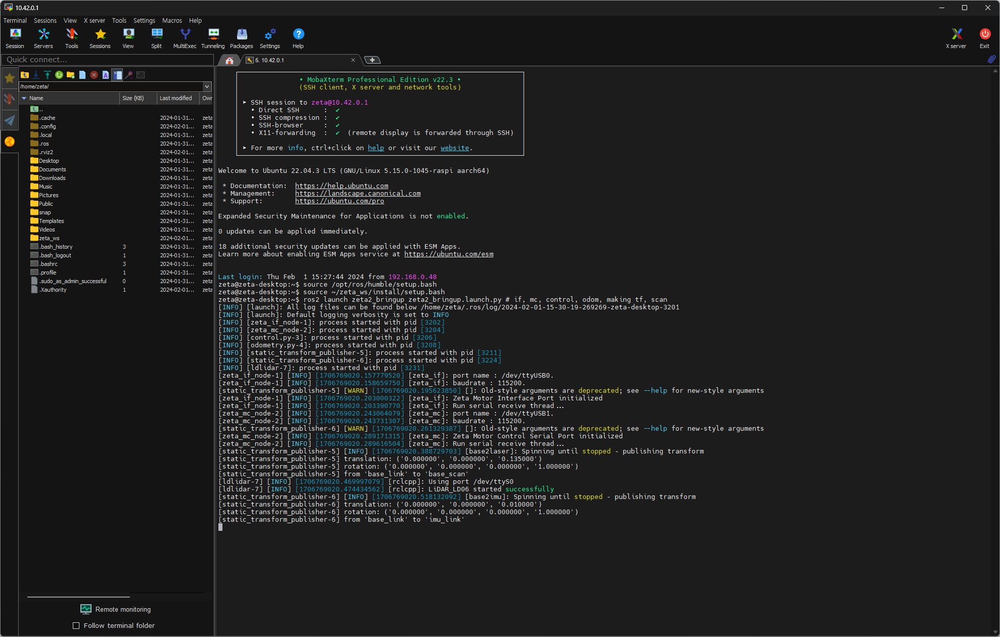

```bash
ros2 launch zeta2_bringup zeta2_bringup.launch.py # if, mc, control, odom, making tf, scan
```
2. 조이스틱 조작을 위해 zeta_joy를 실행한다.

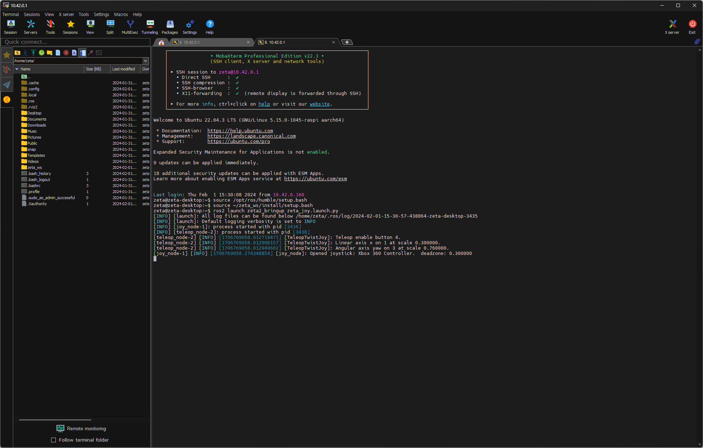

```bash
ros2 launch zeta2_bringup zeta_joy.launch.py
```
3. zeta_slam_toolbox를 실행한다.

```bash
ros2 launch zeta2_slam_toolbox zeta2_slam_toolbox.launch.py
```
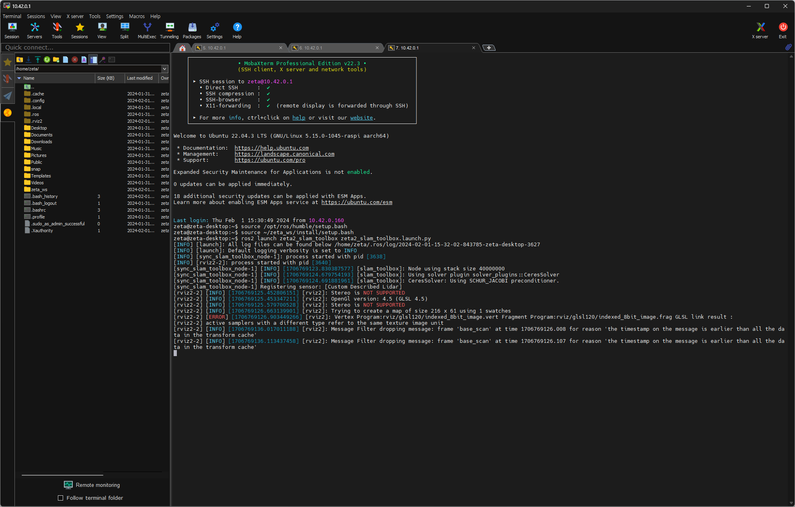

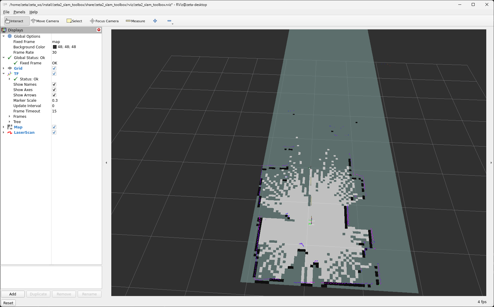

4. 조이스틱으로 조작하며 맵을 확장해나간다.

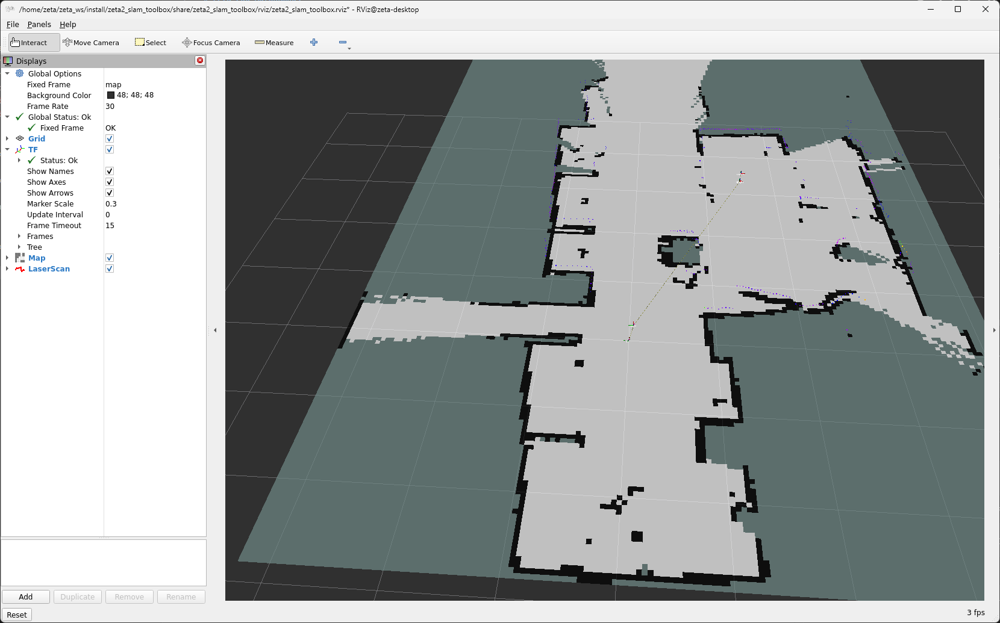

5. rviz 화면을 보고 지도를 다 그리면 지도를 저장한다. 'Map saved successfully'가 나오면 성공
```bash
## ros2 run nav2_map_server map_saver_cli -f {원하는 지도 이름}
## 예시
ros2 run nav2_map_server map_saver_cli -f slam_toolbox_seongsu
```
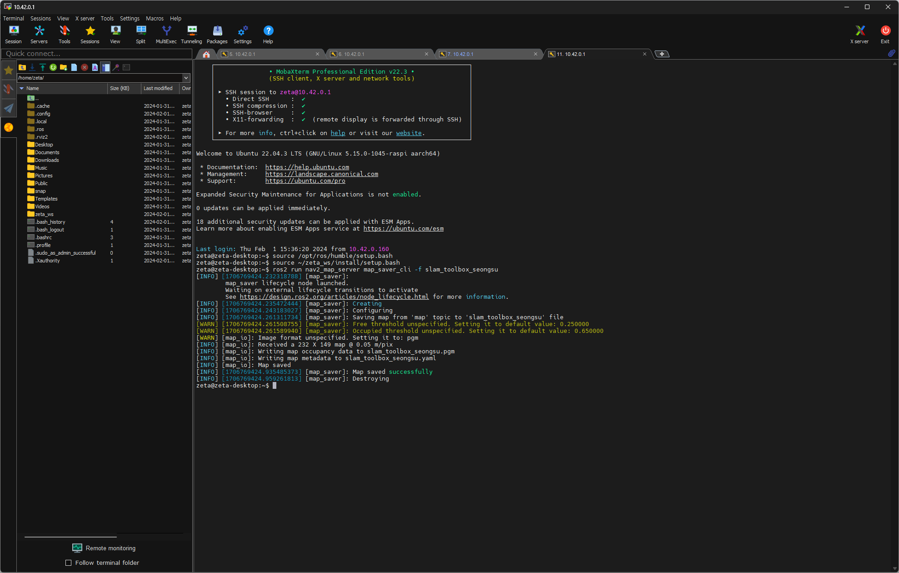


## cartographer 매핑

1. zeta2_bringup을 실행한다.


```bash
ros2 launch zeta2_bringup zeta2_bringup.launch.py # if, mc, control, odom, making tf, scan
```
2. 조이스틱 조작을 위해 zeta_joy를 실행한다.


```bash
ros2 launch zeta2_bringup zeta_joy.launch.py
```
3. zeta_cartographer를 실행한다.
```bash
ros2 launch zeta2_cartographer zeta2_cartographer.launch.py
```

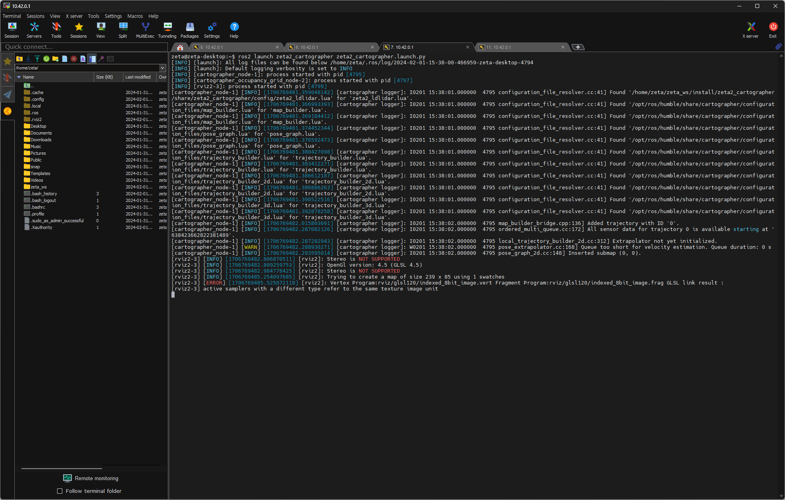

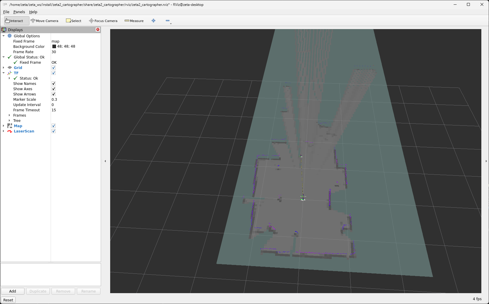

4. 조이스틱으로 조작하며 맵을 확장해나간다.

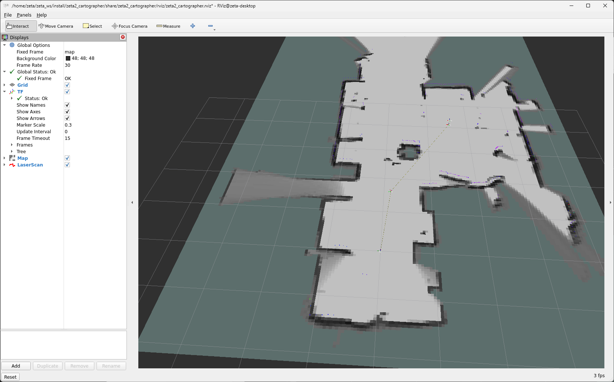


3. rviz 화면을 보고 지도를 다 그리면 지도를 저장한다. 'Map saved successfully'가 나오면 성공
```bash
## ros2 run nav2_map_server map_saver_cli -f {원하는 지도 이름}
## 예시
ros2 run nav2_map_server map_saver_cli -f carto_seongsu
```

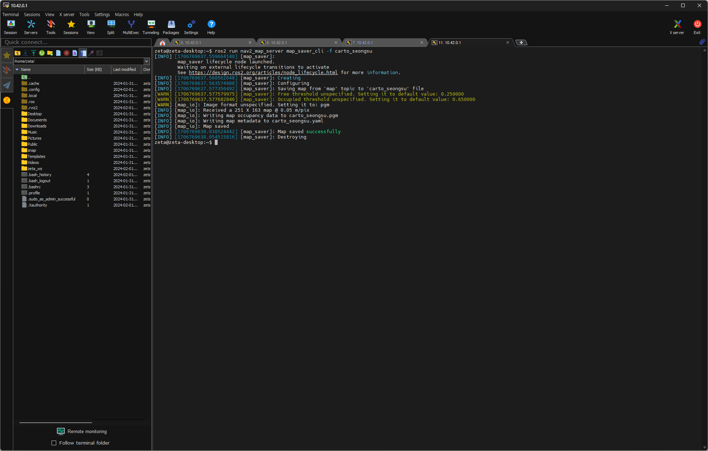


## navigation2 실행

1. 만들었던 맵을 zeta2_navigation/maps 폴더에 잘 넣는다.

2. 맵을 다 넣었다면 zeta2_navigation 패키지만 빌드를 해준다.
```bash
cd ~/zeta_ws
colcon build --packages-select zeta2_navigation
```

3. zeta2_navigation 패키지의 zeta2_navigation 런치 파일을 실행한다.
```bash
source ~/zeta_ws/install/setup.bash

ros2 launch zeta2_navigation zeta2_navigation.launch.py
```

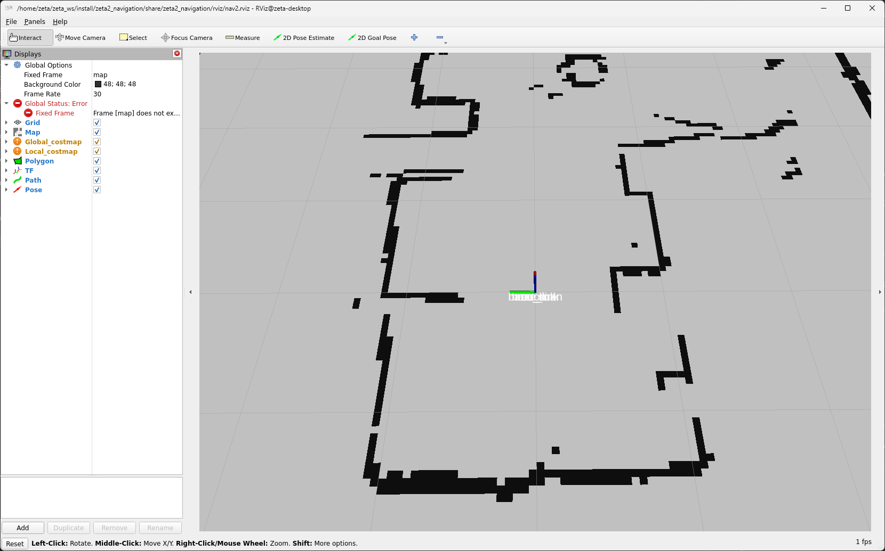

4. 로봇의 초기 위치를 세팅한다. 2D Pose Estimate를 클릭하고 초기 위치와 방향에 맞춰 드래그 한다.

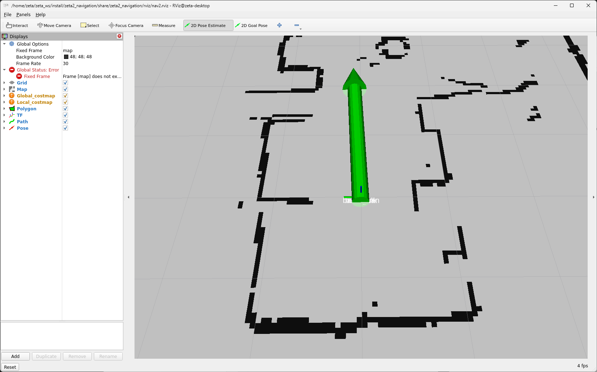

5. 2D Goas Pose를 클릭하고 원하는 위치 방향에 맞춰 드래그 하면 로봇이 움직인다.

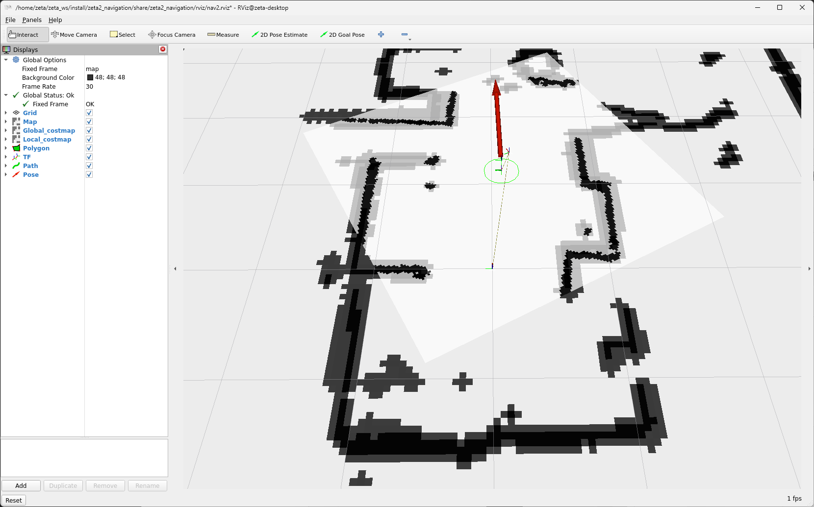
